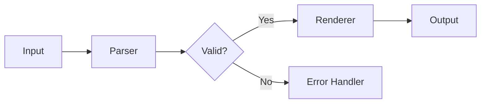
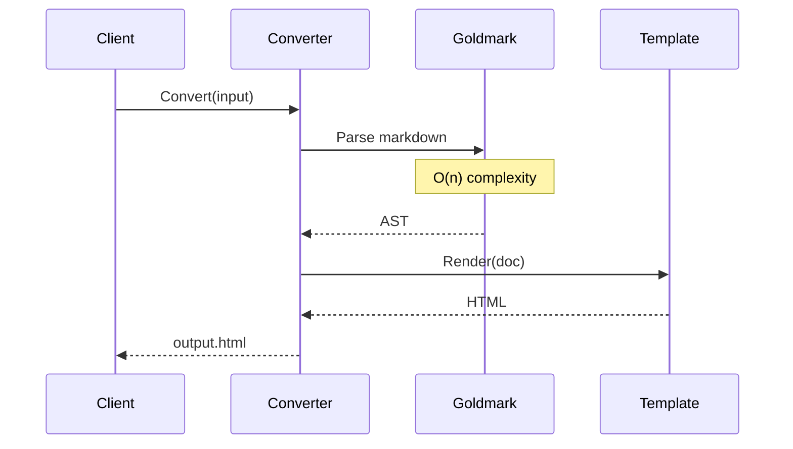
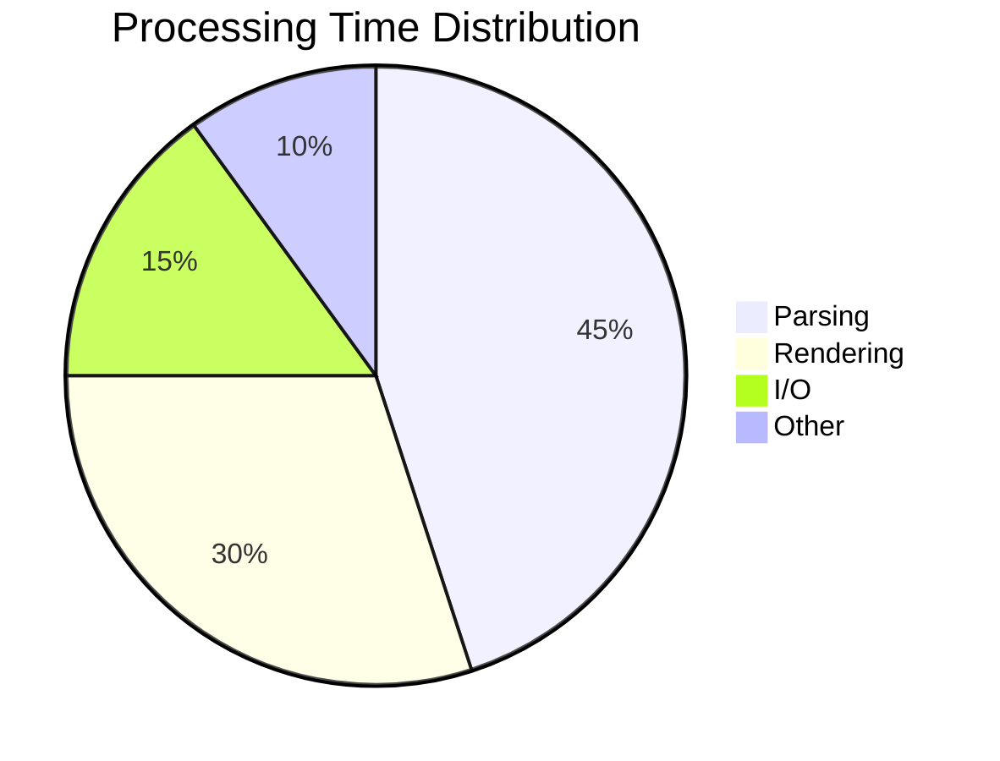
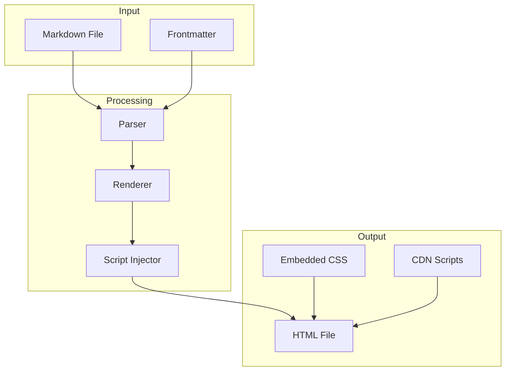

# Combined Features Demo

This document demonstrates using Mermaid diagrams and math equations together.

## System Architecture with Math

The system processes requests with complexity $O(\log n)$ where $n$ is the number of items:



The time complexity for conversion is approximately:

$$
T(n) = O(n \cdot \log n)
$$

Where $n$ is the document size in bytes.

## Algorithm Flow



The rendering pipeline has constant space complexity:

$$
S(n) = O(1)
$$

## Performance Metrics



Average processing speed: $\approx 1.2 \text{ MB/s}$

## Feature Matrix

| Feature | Complexity | Enabled |
|---------|------------|---------|
| Tables | $O(n \cdot m)$ | ✓ |
| Footnotes | $O(n)$ | ✓ |
| Math | $O(k)$ | ✓ |
| Diagrams | $O(v + e)$ | ✓ |

Where:
- $n$ = number of rows
- $m$ = number of columns  
- $k$ = number of equations
- $v$ = vertices, $e$ = edges

## Data Flow



Output size estimation:

$$
\text{Size}_{\text{output}} = \text{Size}_{\text{input}} \times 1.5 + \text{Size}_{\text{CSS}} + \text{Size}_{\text{JS}}
$$

---

Generate this with all features:
```bash
mkdown combined-demo.md --mermaid --math
```

