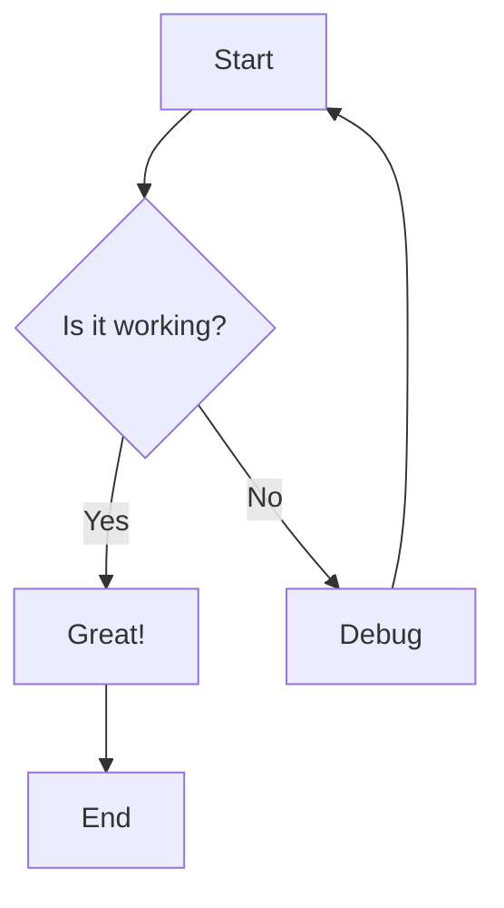
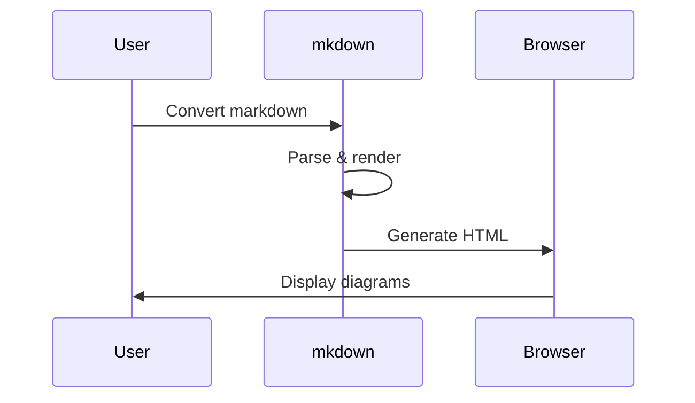
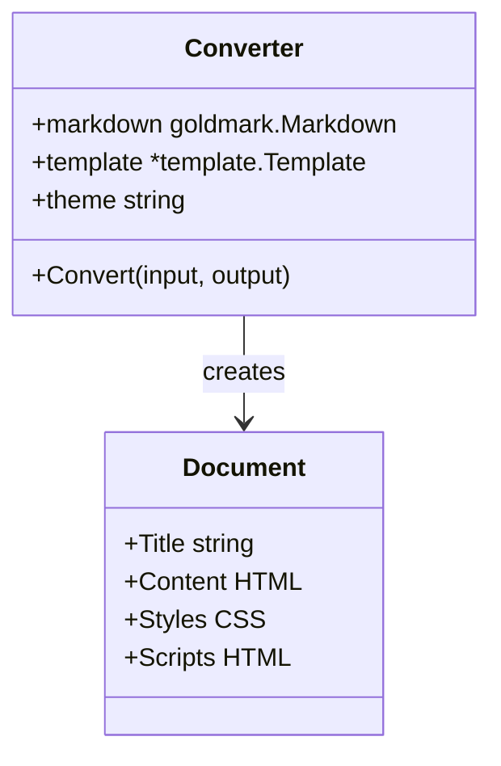
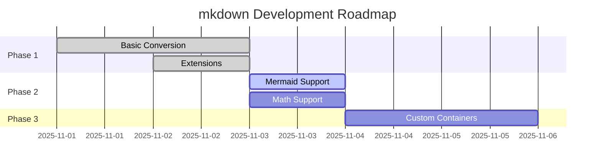
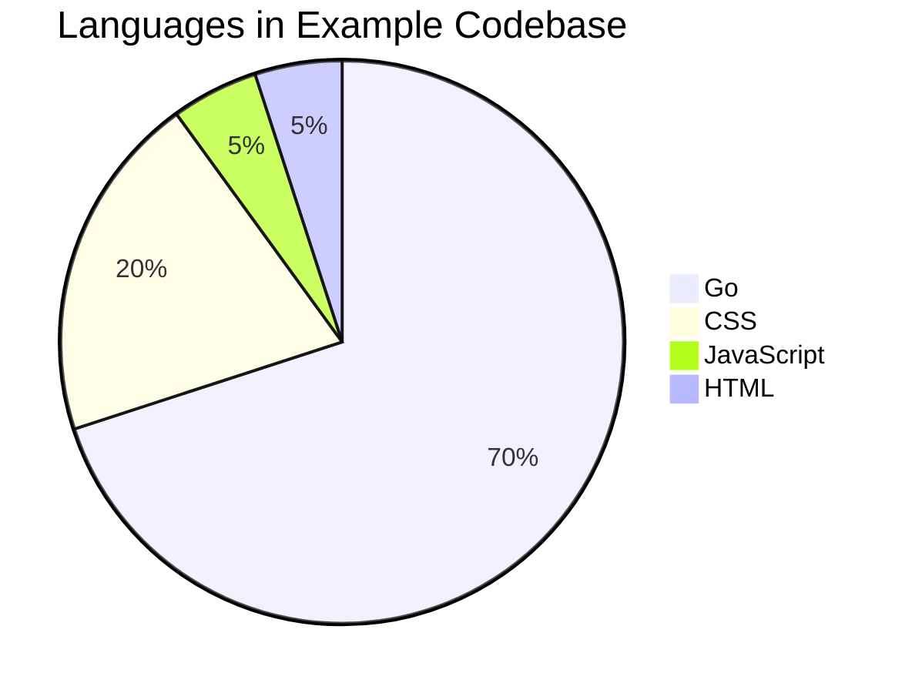

# Mermaid Diagram Examples

This document demonstrates Mermaid diagram support.

## Flowchart



## Sequence Diagram



## Class Diagram



## Gantt Chart



## Pie Chart



---

## Fullscreen Mode

Each diagram has a fullscreen button (⛶) in the top-right corner. Click it to:
- Expand diagram to full screen
- View large diagrams without scrolling
- Close with Escape key or click the ✕ button

Perfect for complex flowcharts, large sequence diagrams, or detailed class diagrams!

---

**Note**: Mermaid diagrams require internet connection to load the Mermaid.js library from CDN.

To generate this file:
```bash
mkdown mermaid-demo.md --mermaid
```

