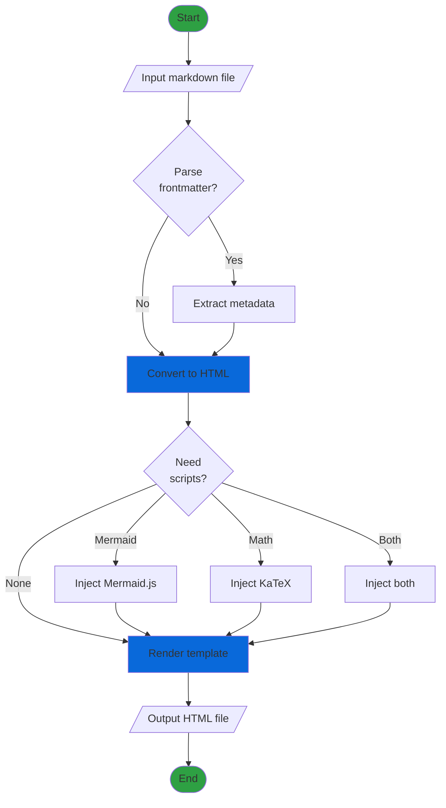
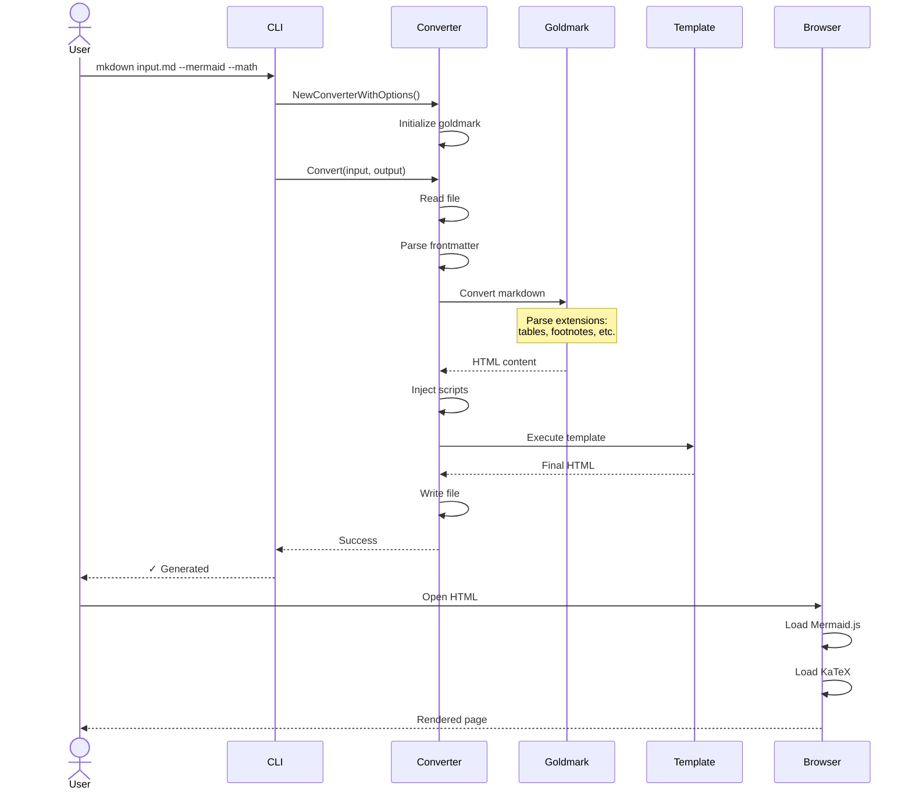
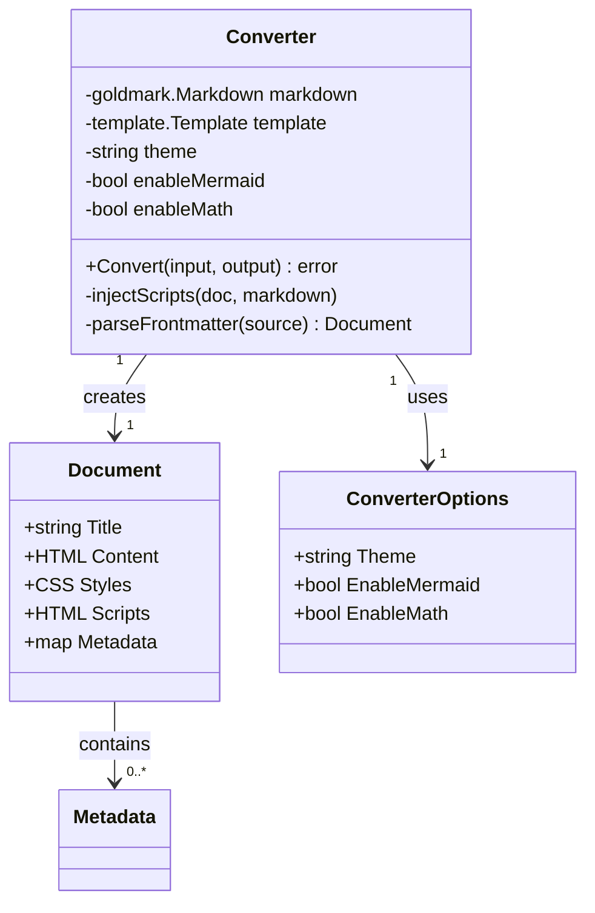
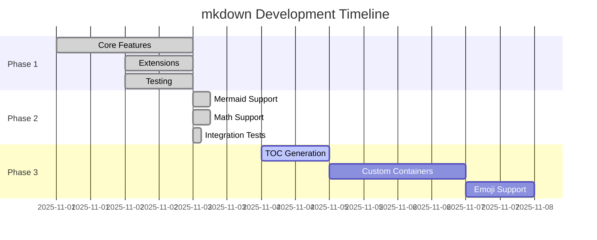
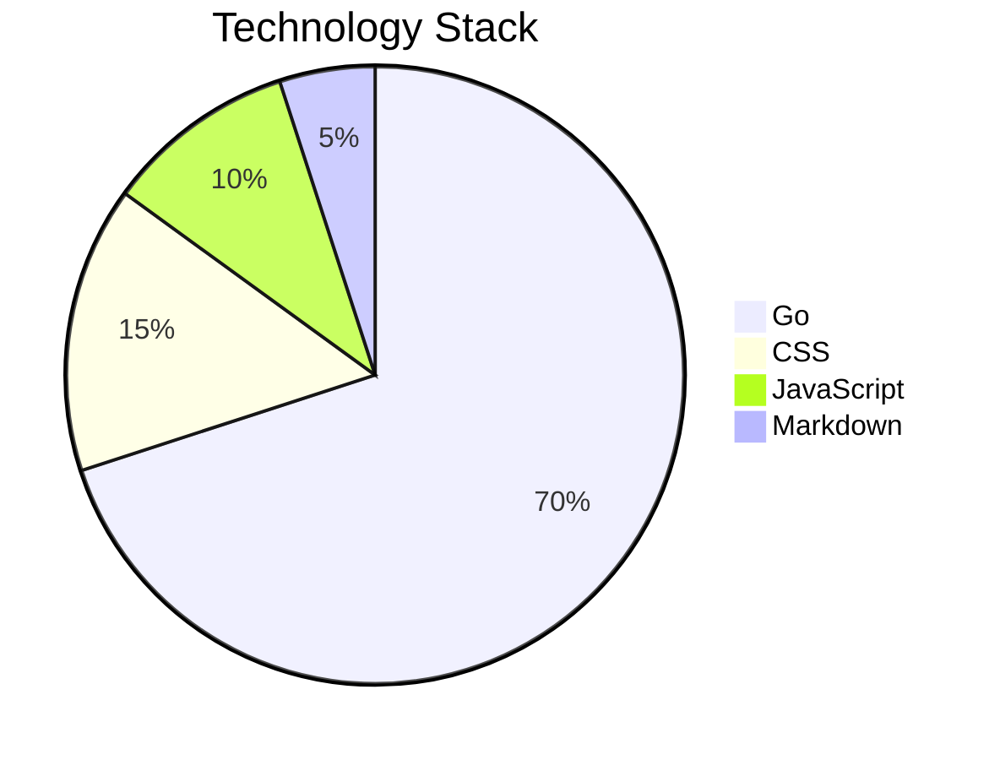
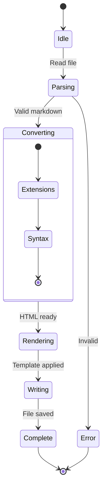

# mkdown Complete Feature Showcase

This document demonstrates **every feature** available in mkdown. Generate with:

```bash
mkdown showcase.md --mermaid --math
```

---

## Table of Contents

- Basic Markdown
- Tables
- Task Lists
- Footnotes
- Definition Lists
- Typography
- Code & Syntax Highlighting
- Math Equations
- Mermaid Diagrams

---

## 1. Basic Markdown

### Emphasis

This is **bold text**, this is *italic text*, and this is ~~strikethrough~~.

You can combine them: ***bold and italic***, ~~***all three***~~.

### Links & Images

Visit the [mkdown repository](https://github.com/ekinertac/mkdown) for source code.

Auto-linkify works too: https://github.com/ekinertac/mkdown

### Blockquotes

> "The best way to predict the future is to invent it."  
> --- Alan Kay

Nested quotes work too:

> First level
>> Second level
>>> Third level

### Lists

**Unordered:**
- Feature rich
- Fast compilation
- Easy to use
  - Nested items work
  - Multiple levels
    - Even deeper

**Ordered:**
1. Install mkdown
2. Write markdown
3. Run conversion
4. Open HTML

### Horizontal Rules

Three ways to create them:

---

***

___

## 2. Tables

| Feature | Phase | Status | Description |
|---------|-------|--------|-------------|
| Tables | 1 | ✅ | GitHub-style tables |
| Footnotes | 1 | ✅ | Reference citations[^tables] |
| Mermaid | 2 | ✅ | Diagram support |
| Math | 2 | ✅ | LaTeX equations |

### Aligned Tables

| Left Align | Center Align | Right Align |
|:-----------|:------------:|------------:|
| Left | Center | Right |
| $x$ | $y$ | $z$ |

[^tables]: Tables support full markdown syntax inside cells!

## 3. Task Lists

### Project Status

- [x] Phase 1: Core extensions
  - [x] Tables
  - [x] Footnotes
  - [x] Definition lists
  - [x] Typographer
- [x] Phase 2: JavaScript features
  - [x] Mermaid diagrams
  - [x] Math rendering
- [ ] Phase 3: Advanced features
  - [ ] Table of contents
  - [ ] Custom containers
  - [ ] Emoji support

## 4. Footnotes

This is a sentence with a simple footnote[^1]. You can have multiple footnotes[^2] throughout your document.

Footnotes can contain complex content[^complex] including code and multiple paragraphs.

[^1]: This is the first footnote. It appears at the bottom.

[^2]: This is another footnote with **bold text** and *italics*.

[^complex]: Footnotes can contain multiple paragraphs.

    They can include code:
    
    ```python
    print("Hello from a footnote!")
    ```
    
    And even math: $E = mc^2$

## 5. Definition Lists

**Technical Terms:**

API
: Application Programming Interface
: A set of protocols for building software

Markdown
: A lightweight markup language
: Created by John Gruber in 2004

**Mathematical Concepts:**

Algorithm Complexity
: $O(n)$ -- Linear time
: $O(\log n)$ -- Logarithmic time
: $O(n^2)$ -- Quadratic time

Asymptotic Notation
: Big O: Upper bound $O(f(n))$
: Big Omega: Lower bound $\Omega(f(n))$
: Big Theta: Tight bound $\Theta(f(n))$

## 6. Smart Typography

The typographer feature converts plain ASCII to proper typography:

### Quotes

"Double quotes" become smart quotes. 'Single quotes' too.

### Dashes

- Two hyphens -- become an en-dash (range: 1--10)
- Three hyphens --- become an em-dash (used for breaks in thought)
- Use en-dash for ranges: pages 10--20
- Use em-dash for emphasis---like this

### Other Symbols

- Three dots... become an ellipsis (…)
- Fractions: 1/2, 1/4, 3/4
- Arrows: --> and <-- and <-->
- Copyright: (c) becomes ©
- Registered: (r) becomes ®
- Trademark: (tm) becomes ™

## 7. Code & Syntax Highlighting

### Inline Code

Use `inline code` for commands like `mkdown input.md` or variables like `theme="dark"`.

### Code Blocks

**Go:**

```go
package main

import (
    "fmt"
    "github.com/ekinertac/mkdown/internal"
)

func main() {
    converter := internal.NewConverterWithOptions(internal.ConverterOptions{
        Theme:         "dark",
        EnableMermaid: true,
        EnableMath:    true,
    })
    
    if err := converter.Convert("input.md", "output.html"); err != nil {
        panic(err)
    }
    
    fmt.Println("✓ Conversion complete!")
}
```

**Python:**

```python
def fibonacci(n):
    """Generate Fibonacci sequence up to n."""
    a, b = 0, 1
    result = []
    while a < n:
        result.append(a)
        a, b = b, a + b
    return result

# Generate first 10 Fibonacci numbers
print(fibonacci(100))
```

**JavaScript:**

```javascript
// React component example
import React, { useState, useEffect } from 'react';

const MarkdownConverter = ({ file }) => {
  const [html, setHtml] = useState('');
  
  useEffect(() => {
    fetch(`/api/convert?file=${file}`)
      .then(res => res.text())
      .then(setHtml);
  }, [file]);
  
  return <div dangerouslySetInnerHTML={{ __html: html }} />;
};
```

**Bash:**

```bash
#!/bin/bash

# Convert all markdown files in a directory
for file in *.md; do
    echo "Converting $file..."
    mkdown "$file" --mermaid --math --theme dark
done

echo "✓ All files converted!"
```

## 8. Math Equations (KaTeX)

### Inline Math

The quadratic formula $x = \frac{-b \pm \sqrt{b^2-4ac}}{2a}$ solves $ax^2 + bx + c = 0$.

Einstein's $E = mc^2$ relates energy and mass. The Pythagorean theorem: $a^2 + b^2 = c^2$.

### Display Math

**Quadratic Formula:**

$$
x = \frac{-b \pm \sqrt{b^2-4ac}}{2a}
$$

**Euler's Identity (most beautiful equation):**

$$
e^{i\pi} + 1 = 0
$$

**Calculus:**

$$
\frac{d}{dx}(x^n) = nx^{n-1} \quad \text{and} \quad \int x^n \, dx = \frac{x^{n+1}}{n+1} + C
$$

**Matrix Operations:**

$$
\begin{bmatrix}
a & b \\
c & d
\end{bmatrix}
\begin{bmatrix}
x \\
y
\end{bmatrix}
=
\begin{bmatrix}
ax + by \\
cx + dy
\end{bmatrix}
$$

**Summation and Products:**

$$
\sum_{i=1}^{n} i = \frac{n(n+1)}{2} \quad \text{and} \quad \prod_{i=1}^{n} i = n!
$$

**Greek Letters:**

$$
\alpha, \beta, \gamma, \Delta, \epsilon, \zeta, \eta, \theta, \lambda, \mu, \pi, \sigma, \tau, \phi, \Phi, \psi, \Psi, \omega, \Omega
$$

**Limits:**

$$
\lim_{x \to \infty} \frac{1}{x} = 0 \quad \text{and} \quad \lim_{h \to 0} \frac{f(x+h) - f(x)}{h} = f'(x)
$$

## 9. Mermaid Diagrams

### Flowchart



### Sequence Diagram



### Class Diagram



### Gantt Chart



### Pie Chart



### State Diagram



---

## 10. Combined Example

Let's combine math and diagrams to explain Big O notation:

The time complexity of binary search is $O(\log n)$, which means:

$$
T(n) = c \cdot \log_2(n)
$$

Here's how it works:


The efficiency compared to linear search $O(n)$:

$$
\frac{O(\log n)}{O(n)} = \frac{\log n}{n} \to 0 \text{ as } n \to \infty
$$

---

## Summary

This document demonstrates:

✅ **Phase 1 Features:**
- Tables with alignment
- Task lists
- Strikethrough
- Footnotes with complex content
- Definition lists
- Smart typography (quotes, dashes, ellipsis)
- Auto-linkify URLs
- Syntax highlighting (20+ languages)
- Auto heading IDs

✅ **Phase 2 Features:**
- Mermaid diagrams (6 types shown)
- Math equations (inline and block)
- Theme support (dark/light)

**Total features demonstrated:** 15+

**Generate this file:**
```bash
# With all features enabled
mkdown showcase.md --mermaid --math

# Light theme
mkdown showcase.md --mermaid --math --theme light

# Custom output
mkdown showcase.md --mermaid --math -o awesome.html
```

---

**Made with [mkdown](https://github.com/ekinertac/mkdown)** - A fast, feature-rich markdown to HTML converter written in Go.

